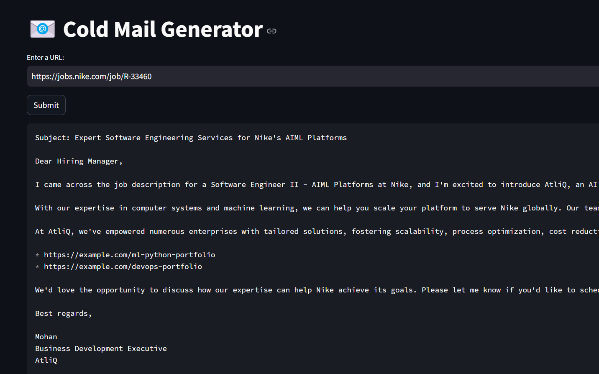

# 📧 Personal Job Application Mail Generator

This tool helps generate professional cold emails for **job applications** using **Groq, LangChain, and Streamlit**.  
It allows you to input the URL of a company’s careers page. The tool then extracts job listings from that page and generates **personalized application emails**. These emails are addressed to the **hiring manager** and include your **resume** (instead of a portfolio) to highlight your skills and experience.  

---

## 📌 Example Scenario

- Nike posts an opening for a **Principal Software Engineer** on their careers page.  
- Instead of only applying through the portal, **Sid** (the applicant) wants to directly reach out to the hiring manager.  
- The tool generates a tailored cold email addressed to the hiring manager, and Sid attaches his **resume** for consideration.  



---

## 🏗️ Architecture Diagram


---

## ⚙️ Set-up

1. **Get API Key**  
   - Create a Groq API key here: [https://console.groq.com/keys](https://console.groq.com/keys).  
   - Inside `app/.env`, update the value of `GROQ_API_KEY` with the API key you created.  

2. **Install dependencies**  
   ```bash
   pip install -r requirements.txt
